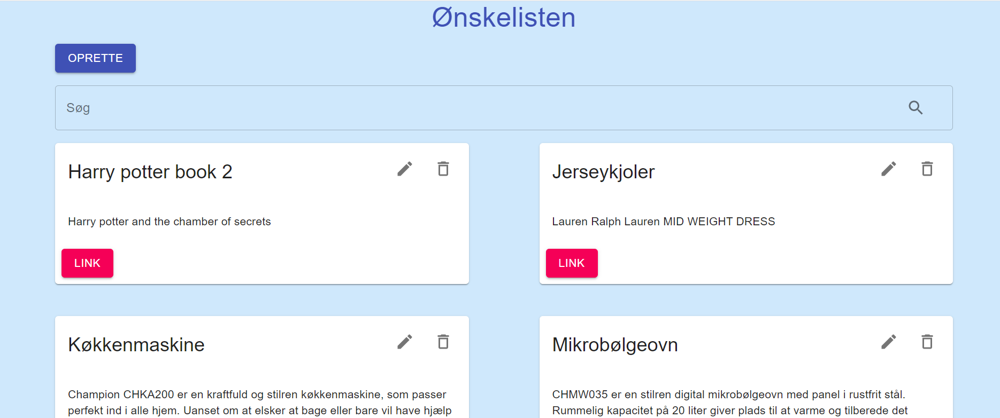
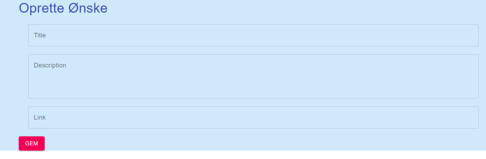
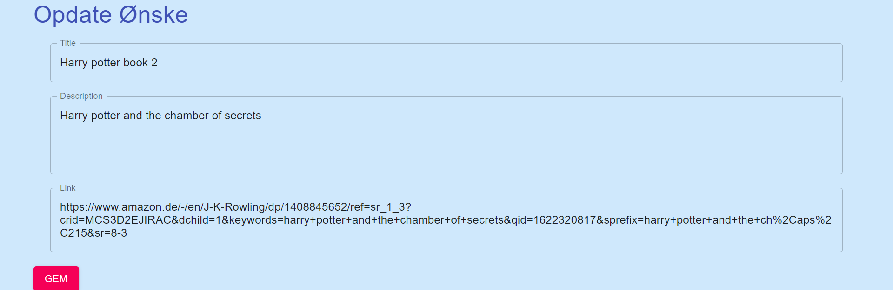
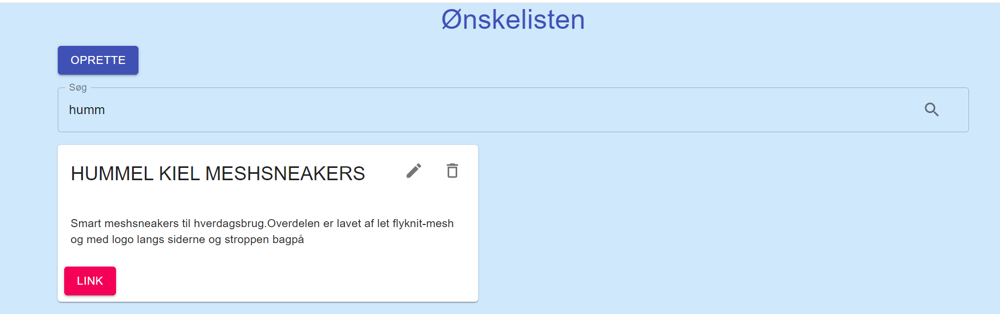

# Getting Started with Create React App

This project was bootstrapped with [Create React App](https://github.com/facebook/create-react-app).

## Running the app

In the project directory, you can run:

```npm start```

Runs the app in the development mode.\
Open [http://localhost:3000](http://localhost:3000) to view it in the browser.


## General info
This project is a web application using React and material-ui to create, update and show a list of wish items. It is also possible to seach for a specific item. Wishes are managed through a Laravel API. Some screen shots of the web application is shown below.
<br/>

<br/>

<br/>


<br/>

<br/>

## Technologies
Project is created with:
* React: 8.0
* material ui
* laravel backend for API.
